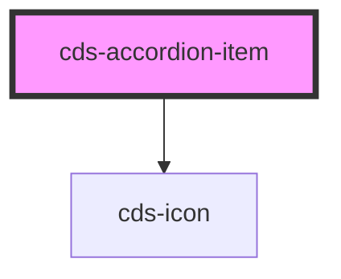

# cds-accordion

<!-- Auto Generated Below -->

## Properties

| Property      | Attribute      | Description   | Type      | Default     |
| ------------- | -------------- | ------------- | --------- | ----------- |
| `drawerTitle` | `drawer-title` | Drawer title  | `string`  | `undefined` |
| `iconAlign`   | `icon-align`   | iconAlignment | `string`  | `undefined` |
| `open`        | `open`         | isOpen        | `boolean` | `false`     |

## Events

| Event           | Description                      | Type               |
| --------------- | -------------------------------- | ------------------ |
| `drawerClicked` | Accordion drawer (title) clicked | `CustomEvent<any>` |

## Slots

| Slot | Description |
| ---- | ----------- |
|      | Content     |

## Dependencies

### Depends on

- [cds-icon](../../../elements/icon)

### Graph

----------------------------------------------

*Built with [StencilJS](https://stenciljs.com/)*
