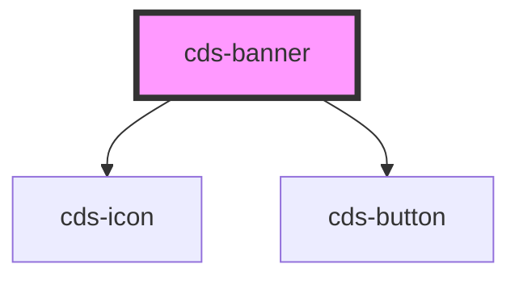

# cds-banner

<!-- Auto Generated Below -->

## Properties

| Property      | Attribute      | Description  | Type                                                                                                                                      | Default       |
| ------------- | -------------- | ------------ | ----------------------------------------------------------------------------------------------------------------------------------------- | ------------- |
| `actionColor` | `action-color` | Action Color | `"black" \| "danger" \| "dark" \| "info" \| "light" \| "link" \| "primary" \| "secondary" \| "success" \| "text" \| "warning" \| "white"` | `undefined`   |
| `actionLink`  | `action-link`  | Action Link  | `string`                                                                                                                                  | `undefined`   |
| `actionText`  | `action-text`  | Action Text  | `string`                                                                                                                                  | `undefined`   |
| `class`       | `class`        | CSS Class    | `string`                                                                                                                                  | `undefined`   |
| `color`       | `color`        | color        | `"black" \| "danger" \| "dark" \| "info" \| "light" \| "link" \| "primary" \| "secondary" \| "success" \| "warning" \| "white"`           | `undefined`   |
| `light`       | `light`        | Is Light     | `boolean`                                                                                                                                 | `undefined`   |
| `position`    | `position`     | Position     | `"fixed-bottom" \| "fixed-top" \| "float-bottom" \| "float-top"`                                                                          | `'fixed-top'` |
| `show`        | `show`         | Show         | `boolean`                                                                                                                                 | `true`        |

## Events

| Event           | Description       | Type               |
| --------------- | ----------------- | ------------------ |
| `actionClicked` | On Action Clicked | `CustomEvent<any>` |

## Slots

| Slot | Description |
| ---- | ----------- |
|      | Content     |

## Dependencies

### Depends on

- [cds-icon](../../elements/icon)
- [cds-button](../../elements/button)

### Graph

----------------------------------------------

*Built with [StencilJS](https://stenciljs.com/)*
