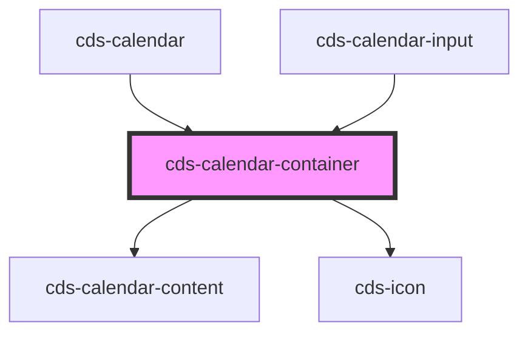

# cds-calendar-container

<!-- Auto Generated Below -->

## Properties

| Property      | Attribute | Description   | Type   | Default     |
| ------------- | --------- | ------------- | ------ | ----------- |
| `currentDate` | --        | Selected Date | `Date` | `undefined` |

## Events

| Event      | Description      | Type               |
| ---------- | ---------------- | ------------------ |
| `selected` | On date selected | `CustomEvent<any>` |

## Dependencies

### Used by

 - [cds-calendar](..)
 - [cds-calendar-input](../calendar-input)

### Depends on

- [cds-calendar-content](../calendar-content)
- [cds-icon](../../../elements/icon)

### Graph

----------------------------------------------

*Built with [StencilJS](https://stenciljs.com/)*
