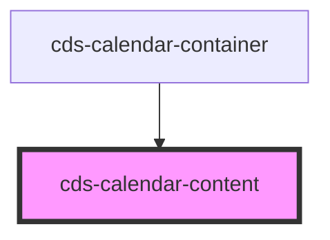

# cds-calendar-content

<!-- Auto Generated Below -->

## Properties

| Property      | Attribute  | Description                          | Type                                          | Default      |
| ------------- | ---------- | ------------------------------------ | --------------------------------------------- | ------------ |
| `currentDate` | --         | Current Date                         | `Date`                                        | `undefined`  |
| `displayDate` | --         | Display Date (Current Display Month) | `Date`                                        | `new Date()` |
| `position`    | `position` | Position                             | `"current" \| "nextContent" \| "prevContent"` | `'current'`  |
| `view`        | `view`     | view                                 | `"days" \| "months" \| "years"`               | `'days'`     |

## Events

| Event              | Description          | Type               |
| ------------------ | -------------------- | ------------------ |
| `gotoTodayClicked` | on go to today click | `CustomEvent<any>` |
| `selected`         | On date selected     | `CustomEvent<any>` |
| `viewUpdated`      | On view updated      | `CustomEvent<any>` |

## Dependencies

### Used by

 - [cds-calendar-container](../calendar-container)

### Graph

----------------------------------------------

*Built with [StencilJS](https://stenciljs.com/)*
