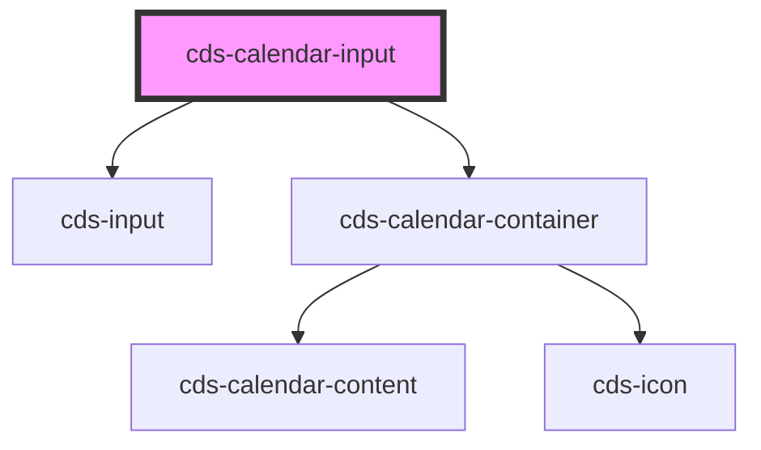

# cds-calendar-input

<!-- Auto Generated Below -->

## Properties

| Property          | Attribute          | Description                                                                                        | Type                                         | Default     |
| ----------------- | ------------------ | -------------------------------------------------------------------------------------------------- | -------------------------------------------- | ----------- |
| `disabled`        | `disabled`         | Disabled state                                                                                     | `boolean`                                    | `false`     |
| `format`          | `format`           | Format                                                                                             | `string`                                     | `'L'`       |
| `inputAttributes` | `input-attributes` | inputAttributes - adds custom attributes to the input field declared attributes will be overridden | `any`                                        | `null`      |
| `inputId`         | `input-id`         | Unique id (used in input and label)                                                                | `string`                                     | `undefined` |
| `inputStatus`     | `input-status`     | Input status                                                                                       | `"danger" \| "success"`                      | `undefined` |
| `label`           | `label`            | Label for input                                                                                    | `string`                                     | `undefined` |
| `loading`         | `loading`          | Loading state                                                                                      | `boolean`                                    | `false`     |
| `message`         | `message`          | Message                                                                                            | `string`                                     | `undefined` |
| `name`            | `name`             | Name                                                                                               | `string`                                     | `''`        |
| `placeholder`     | `placeholder`      | Placeholder                                                                                        | `string`                                     | `undefined` |
| `readonly`        | `readonly`         | The input will look similar to a normal one, but is not editable and has no shadow                 | `boolean`                                    | `false`     |
| `required`        | `required`         | Required                                                                                           | `boolean`                                    | `false`     |
| `rounded`         | `rounded`          | Rounded                                                                                            | `boolean`                                    | `false`     |
| `show`            | `show`             | Show Calendar                                                                                      | `boolean`                                    | `undefined` |
| `size`            | `size`             | Size                                                                                               | `"large" \| "medium" \| "normal" \| "small"` | `undefined` |
| `state`           | `state`            | State                                                                                              | `"focused" \| "hovered"`                     | `undefined` |
| `static`          | `static`           | Removes the background, border, shadow, and horizontal padding                                     | `boolean`                                    | `false`     |
| `value`           | `value`            | value                                                                                              | `string`                                     | `undefined` |

## Events

| Event      | Description      | Type               |
| ---------- | ---------------- | ------------------ |
| `selected` | On date selected | `CustomEvent<any>` |

## Methods

### `setDate(value: Date) => Promise<void>`

Set Date

#### Returns

Type: `Promise<void>`

## Slots

| Slot | Description     |
| ---- | --------------- |
|      | Trigger Content |

## Dependencies

### Depends on

- [cds-input](../../../forms/input)
- [cds-calendar-container](../calendar-container)

### Graph

----------------------------------------------

*Built with [StencilJS](https://stenciljs.com/)*
