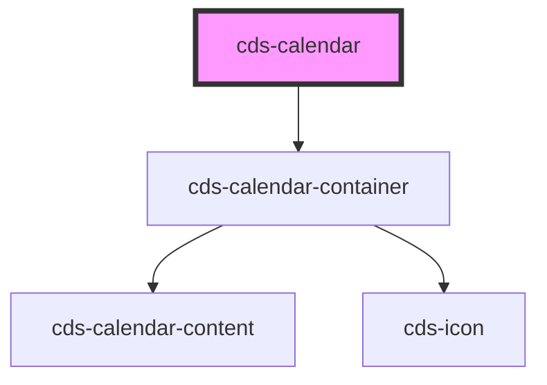

# cds-calendar

<!-- Auto Generated Below -->

## Properties

| Property | Attribute | Description   | Type      | Default     |
| -------- | --------- | ------------- | --------- | ----------- |
| `format` | `format`  | Format        | `string`  | `'L'`       |
| `show`   | `show`    | Show Calendar | `boolean` | `undefined` |
| `value`  | `value`   | value         | `string`  | `undefined` |

## Events

| Event      | Description      | Type               |
| ---------- | ---------------- | ------------------ |
| `selected` | On date selected | `CustomEvent<any>` |

## Methods

### `setDate(value: Date) => Promise<void>`

Set Date

#### Returns

Type: `Promise<void>`

## Slots

| Slot | Description     |
| ---- | --------------- |
|      | Trigger Content |

## Dependencies

### Depends on

- [cds-calendar-container](calendar-container)

### Graph

----------------------------------------------

*Built with [StencilJS](https://stenciljs.com/)*
