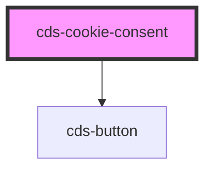

# cds-cookie-consent

<!-- Auto Generated Below -->

## Properties

| Property          | Attribute          | Description      | Type                                                                                                                            | Default            |
| ----------------- | ------------------ | ---------------- | ------------------------------------------------------------------------------------------------------------------------------- | ------------------ |
| `accessibleLabel` | `accessible-label` | accessible label | `string`                                                                                                                        | `'Cookie Consent'` |
| `background`      | `background`       | background       | `"black" \| "danger" \| "dark" \| "info" \| "light" \| "link" \| "primary" \| "secondary" \| "success" \| "warning" \| "white"` | `'dark'`           |
| `buttonColor`     | `button-color`     | button color     | `"black" \| "danger" \| "dark" \| "info" \| "light" \| "link" \| "primary" \| "secondary" \| "success" \| "warning" \| "white"` | `'primary'`        |
| `buttonText`      | `button-text`      | button text      | `string`                                                                                                                        | `'Got it!'`        |
| `class`           | `class`            | CSS classes      | `string`                                                                                                                        | `undefined`        |
| `position`        | `position`         | position         | `"bottom" \| "bottom-left" \| "bottom-right" \| "top" \| "top-left" \| "top-right"`                                             | `'bottom-right'`   |
| `show`            | `show`             | show             | `boolean`                                                                                                                       | `true`             |

## Events

| Event       | Description   | Type               |
| ----------- | ------------- | ------------------ |
| `confirmed` | confirm event | `CustomEvent<any>` |

## Slots

| Slot | Description |
| ---- | ----------- |
|      | Content     |

## Dependencies

### Depends on

- [cds-button](../../elements/button)

### Graph

----------------------------------------------

*Built with [StencilJS](https://stenciljs.com/)*
