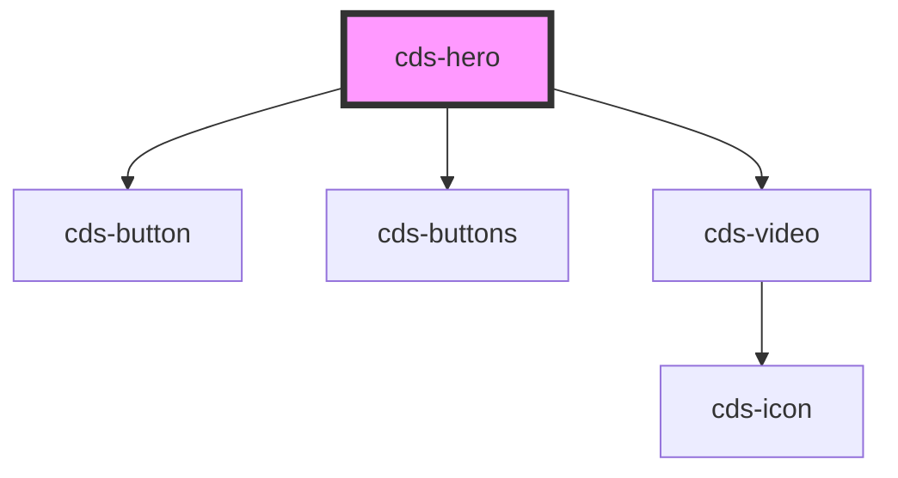

# cds-hero

<!-- Auto Generated Below -->

## Properties

| Property          | Attribute          | Description          | Type                                                                                                                                                      | Default     |
| ----------------- | ------------------ | -------------------- | --------------------------------------------------------------------------------------------------------------------------------------------------------- | ----------- |
| `copy`            | `copy`             | Copy                 | `string`                                                                                                                                                  | `undefined` |
| `copyColor`       | `copy-color`       | Copy Color           | `"black" \| "danger" \| "dark" \| "grey" \| "grey-light" \| "info" \| "light" \| "link" \| "primary" \| "secondary" \| "success" \| "warning" \| "white"` | `undefined` |
| `heading`         | `heading`          | Heading              | `string`                                                                                                                                                  | `undefined` |
| `headingColor`    | `heading-color`    | Heading Color        | `"black" \| "danger" \| "dark" \| "grey" \| "grey-light" \| "info" \| "light" \| "link" \| "primary" \| "secondary" \| "success" \| "warning" \| "white"` | `undefined` |
| `image`           | `image`            | Background image url | `string`                                                                                                                                                  | `undefined` |
| `overlay`         | `overlay`          | Background overlay   | `"darken-light" \| "darken-medium" \| "darken-normal" \| "darken-strong" \| "lighten-light" \| "lighten-medium" \| "lighten-normal" \| "lighten-strong"`  | `undefined` |
| `primaryAction`   | `primary-action`   | Primary Action       | `string`                                                                                                                                                  | `undefined` |
| `secondaryAction` | `secondary-action` | Secondary Action     | `string`                                                                                                                                                  | `undefined` |
| `size`            | `size`             | Size                 | `"fullheight" \| "large" \| "medium"`                                                                                                                     | `undefined` |
| `video`           | `video`            | Video url            | `string`                                                                                                                                                  | `undefined` |
| `videoEmbedded`   | `video-embedded`   | Video embedded       | `boolean`                                                                                                                                                 | `undefined` |

## Events

| Event              | Description                            | Type               |
| ------------------ | -------------------------------------- | ------------------ |
| `primaryClicked`   | Triggers when primary action clicked   | `CustomEvent<any>` |
| `secondaryClicked` | Triggers when secondary action clicked | `CustomEvent<any>` |

## Slots

| Slot       | Description    |
| ---------- | -------------- |
| `"footer"` | Footer Content |
| `"header"` | Header Content |

## Dependencies

### Depends on

- [cds-button](../../elements/button)
- [cds-buttons](../../elements/buttons)
- [cds-video](../../elements/video)

### Graph

----------------------------------------------

*Built with [StencilJS](https://stenciljs.com/)*
