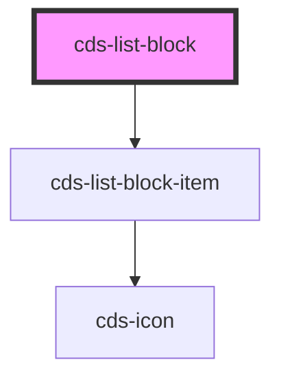

# cds-list-block

<!-- Auto Generated Below -->

## Properties

| Property         | Attribute          | Description                                                      | Type      | Default     |
| ---------------- | ------------------ | ---------------------------------------------------------------- | --------- | ----------- |
| `border`         | `border`           | Adds horizontal border between list-block-items                  | `boolean` | `undefined` |
| `iconAlign`      | `icon-align`       | Icon alignment - left, right                                     | `string`  | `'right'`   |
| `listBlockItems` | `list-block-items` | Array of ListBlockItem ( text, icon, backgroundClass, textClass) | `string`  | `undefined` |

## Slots

| Slot | Description |
| ---- | ----------- |
|      | Content     |

## Dependencies

### Depends on

- [cds-list-block-item](list-block-item)

### Graph

----------------------------------------------

*Built with [StencilJS](https://stenciljs.com/)*
