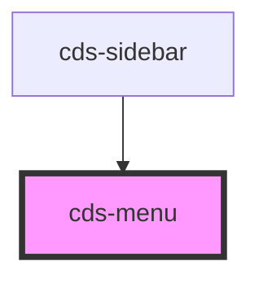

# cds-menu

<!-- Auto Generated Below -->

## Properties

| Property         | Attribute          | Description             | Type     | Default     |
| ---------------- | ------------------ | ----------------------- | -------- | ----------- |
| `activeItemPath` | `active-item-path` | Active Subnav Item path | `string` | `undefined` |
| `class`          | `class`            | CSS Classes             | `string` | `''`        |
| `subnav`         | `subnav`           | Subnav                  | `string` | `undefined` |

## Dependencies

### Used by

 - [cds-sidebar](../sidebar)

### Graph

----------------------------------------------

*Built with [StencilJS](https://stenciljs.com/)*
