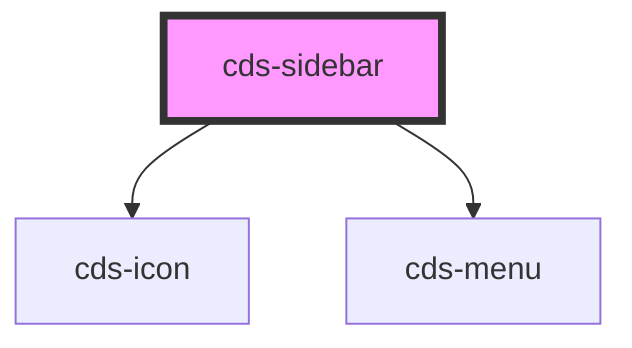

# cds-navbar

<!-- Auto Generated Below -->

## Properties

| Property           | Attribute           | Description             | Type     | Default     |
| ------------------ | ------------------- | ----------------------- | -------- | ----------- |
| `activeItemPath`   | `active-item-path`  | Active Subnav Item path | `string` | `undefined` |
| `logoHref`         | `logo-href`         | Logo href               | `string` | `undefined` |
| `logoPath`         | `logo-path`         | Logo image path         | `string` | `undefined` |
| `slideoutDuration` | `slideout-duration` | Slide out duration      | `number` | `200`       |
| `subnav`           | `subnav`            | Subnav                  | `string` | `undefined` |
| `subnavTitle`      | `subnav-title`      | Title                   | `string` | `undefined` |

## Slots

| Slot | Description |
| ---- | ----------- |
|      | Content     |

## Dependencies

### Depends on

- [cds-icon](../../elements/icon)
- [cds-menu](../menu)

### Graph

----------------------------------------------

*Built with [StencilJS](https://stenciljs.com/)*
