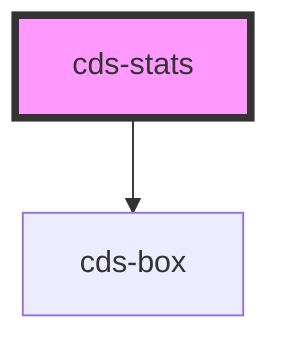

# cds-stats

<!-- Auto Generated Below -->

## Properties

| Property   | Attribute   | Description   | Type                            | Default     |
| ---------- | ----------- | ------------- | ------------------------------- | ----------- |
| `align`    | `align`     | Align         | `"center" \| "left" \| "right"` | `'center'`  |
| `class`    | `class`     | CSS classes   | `string`                        | `undefined` |
| `noBorder` | `no-border` | Is No Border  | `boolean`                       | `undefined` |
| `simple`   | `simple`    | Simple Layout | `boolean`                       | `undefined` |

## Slots

| Slot | Description |
| ---- | ----------- |
|      | Content     |

## Dependencies

### Depends on

- [cds-box](../../elements/box)

### Graph

----------------------------------------------

*Built with [StencilJS](https://stenciljs.com/)*
