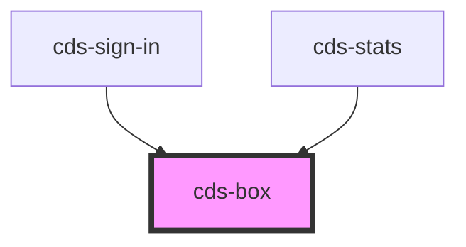

# cds-box

<!-- Auto Generated Below -->

## Properties

| Property | Attribute | Description | Type     | Default |
| -------- | --------- | ----------- | -------- | ------- |
| `class`  | `class`   | CSS classes | `string` | `''`    |

## Slots

| Slot | Description |
| ---- | ----------- |
|      | Content     |

## Dependencies

### Used by

 - [cds-sign-in](../../patterns/sign-in)
 - [cds-stats](../../components/stats)

### Graph

----------------------------------------------

*Built with [StencilJS](https://stenciljs.com/)*
