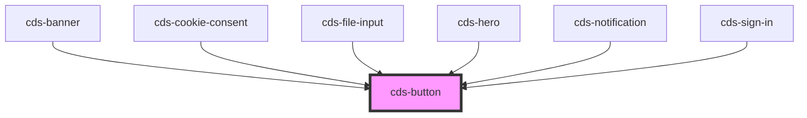

# cds-button

<!-- Auto Generated Below -->

## Properties

| Property    | Attribute   | Description                      | Type                                                                                                                                      | Default     |
| ----------- | ----------- | -------------------------------- | ----------------------------------------------------------------------------------------------------------------------------------------- | ----------- |
| `active`    | `active`    | Active state                     | `boolean`                                                                                                                                 | `false`     |
| `class`     | `class`     | CSS classes                      | `string`                                                                                                                                  | `undefined` |
| `color`     | `color`     | Color                            | `"black" \| "danger" \| "dark" \| "info" \| "light" \| "link" \| "primary" \| "secondary" \| "success" \| "text" \| "warning" \| "white"` | `undefined` |
| `disabled`  | `disabled`  | Is disabled?                     | `boolean`                                                                                                                                 | `false`     |
| `focused`   | `focused`   | Focused state                    | `boolean`                                                                                                                                 | `false`     |
| `fullwidth` | `fullwidth` | Display the button in full-width | `boolean`                                                                                                                                 | `false`     |
| `hovered`   | `hovered`   | Hovered state                    | `boolean`                                                                                                                                 | `false`     |
| `href`      | `href`      | Link href                        | `string`                                                                                                                                  | `''`        |
| `inverted`  | `inverted`  | Is inverted                      | `boolean`                                                                                                                                 | `false`     |
| `light`     | `light`     | Is light color variant           | `boolean`                                                                                                                                 | `false`     |
| `loading`   | `loading`   | Loading state                    | `boolean`                                                                                                                                 | `false`     |
| `outlined`  | `outlined`  | Is outlined                      | `boolean`                                                                                                                                 | `false`     |
| `rounded`   | `rounded`   | Rounded button                   | `boolean`                                                                                                                                 | `false`     |
| `size`      | `size`      | Size                             | `"large" \| "medium" \| "normal" \| "small"`                                                                                              | `undefined` |
| `tag`       | `tag`       | Element tag to render            | `"a" \| "button" \| "input"`                                                                                                              | `'button'`  |
| `type`      | `type`      | Button or input type             | `"button" \| "reset" \| "submit"`                                                                                                         | `undefined` |

## Events

| Event     | Description             | Type               |
| --------- | ----------------------- | ------------------ |
| `clicked` | on button clicked event | `CustomEvent<any>` |

## Slots

| Slot | Description |
| ---- | ----------- |
|      | Content     |

## Dependencies

### Used by

 - [cds-banner](../../components/banner)
 - [cds-cookie-consent](../../components/cookie-consent)
 - [cds-file-input](../../forms/file-input)
 - [cds-hero](../../components/hero)
 - [cds-notification](../../components/notification)
 - [cds-sign-in](../../patterns/sign-in)

### Graph

----------------------------------------------

*Built with [StencilJS](https://stenciljs.com/)*
