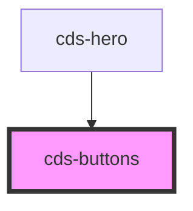

# cds-buttons

<!-- Auto Generated Below -->

## Properties

| Property    | Attribute    | Description               | Type                             | Default     |
| ----------- | ------------ | ------------------------- | -------------------------------- | ----------- |
| `align`     | `align`      | Attached button alignment | `"center" \| "right"`            | `undefined` |
| `class`     | `class`      | CSS classes               | `string`                         | `''`        |
| `hasAddons` | `has-addons` | Attach buttons together   | `boolean`                        | `false`     |
| `size`      | `size`       | Buttons size              | `"large" \| "medium" \| "small"` | `undefined` |

## Slots

| Slot | Description |
| ---- | ----------- |
|      | Content     |

## Dependencies

### Used by

 - [cds-hero](../../components/hero)

### Graph

----------------------------------------------

*Built with [StencilJS](https://stenciljs.com/)*
