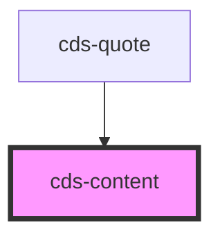

# cds-content

<!-- Auto Generated Below -->

## Properties

| Property | Attribute | Description  | Type                             | Default     |
| -------- | --------- | ------------ | -------------------------------- | ----------- |
| `class`  | `class`   | CSS Classes  | `string`                         | `''`        |
| `size`   | `size`    | Content size | `"large" \| "medium" \| "small"` | `undefined` |

## Slots

| Slot | Description |
| ---- | ----------- |
|      | Content     |

## Dependencies

### Used by

 - [cds-quote](../quote)

### Graph

----------------------------------------------

*Built with [StencilJS](https://stenciljs.com/)*
