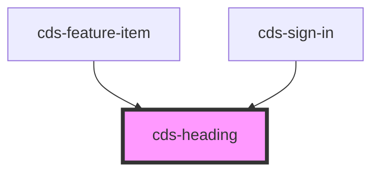

# cds-heading

<!-- Auto Generated Below -->

## Properties

| Property     | Attribute     | Description | Type                                                                                                                                                      | Default     |
| ------------ | ------------- | ----------- | --------------------------------------------------------------------------------------------------------------------------------------------------------- | ----------- |
| `align`      | `align`       | Alignment   | `"centered" \| "justified" \| "left" \| "right"`                                                                                                          | `undefined` |
| `class`      | `class`       | CSS classes | `string`                                                                                                                                                  | `undefined` |
| `color`      | `color`       | Color       | `"black" \| "danger" \| "dark" \| "grey" \| "grey-light" \| "info" \| "light" \| "link" \| "primary" \| "secondary" \| "success" \| "warning" \| "white"` | `undefined` |
| `fontFamily` | `font-family` | Font Family | `"code" \| "monospace" \| "primary" \| "sans-serif" \| "secondary"`                                                                                       | `undefined` |
| `noMargin`   | `no-margin`   | No Margin   | `boolean`                                                                                                                                                 | `undefined` |
| `size`       | `size`        | Size        | `"1" \| "2" \| "3" \| "4" \| "5" \| "6"`                                                                                                                  | `'6'`       |
| `subtitle`   | `subtitle`    | Is Subtitle | `boolean`                                                                                                                                                 | `undefined` |
| `transform`  | `transform`   | Transform   | `"capitalized" \| "italic" \| "lowercase" \| "uppercase"`                                                                                                 | `undefined` |
| `weight`     | `weight`      | Font Weight | `"bold" \| "light" \| "medium" \| "normal" \| "semibold"`                                                                                                 | `'bold'`    |

## Slots

| Slot | Description |
| ---- | ----------- |
|      | Content     |

## Dependencies

### Used by

 - [cds-feature-item](../../components/feature/feature-item)
 - [cds-sign-in](../../patterns/sign-in)

### Graph

----------------------------------------------

*Built with [StencilJS](https://stenciljs.com/)*
