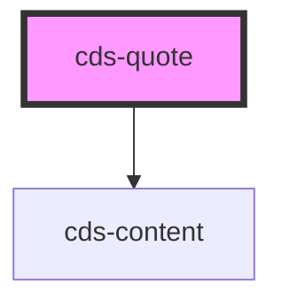

# cds-quote

<!-- Auto Generated Below -->

## Properties

| Property | Attribute | Description | Type     | Default     |
| -------- | --------- | ----------- | -------- | ----------- |
| `class`  | `class`   | CSS Classes | `string` | `''`        |
| `footer` | `footer`  | Footer      | `any`    | `undefined` |

## Slots

| Slot | Description |
| ---- | ----------- |
|      | Content     |

## Dependencies

### Depends on

- [cds-content](../content)

### Graph

----------------------------------------------

*Built with [StencilJS](https://stenciljs.com/)*
