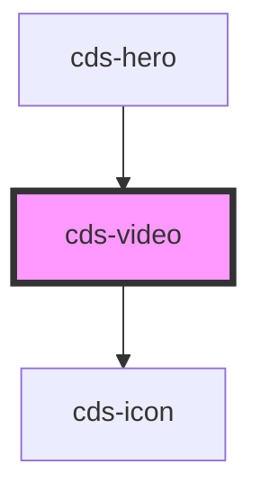

# cds-video

<!-- Auto Generated Below -->

## Properties

| Property   | Attribute   | Description                                            | Type                                                                                                                                                     | Default     |
| ---------- | ----------- | ------------------------------------------------------ | -------------------------------------------------------------------------------------------------------------------------------------------------------- | ----------- |
| `controls` | `controls`  | Show video controls (not applicable to embedded video) | `boolean`                                                                                                                                                | `false`     |
| `embedded` | `embedded`  | Is embedded                                            | `boolean`                                                                                                                                                | `false`     |
| `ratio`    | `ratio`     | Video ratio                                            | `"16by9" \| "1by2" \| "1by3" \| "2by1" \| "2by3" \| "3by1" \| "3by2" \| "3by4" \| "3by5" \| "4by3" \| "4by5" \| "5by3" \| "5by4" \| "9by16" \| "square"` | `'16by9'`   |
| `videoUrl` | `video-url` | Video url                                              | `string`                                                                                                                                                 | `undefined` |

## Methods

### `pauseVideo() => Promise<void>`

Pause video only apply to direct video

#### Returns

Type: `Promise<void>`

### `playVideo() => Promise<void>`

Play video only apply to direct video

#### Returns

Type: `Promise<void>`

## Dependencies

### Used by

 - [cds-hero](../../components/hero)

### Depends on

- [cds-icon](../icon)

### Graph

----------------------------------------------

*Built with [StencilJS](https://stenciljs.com/)*
