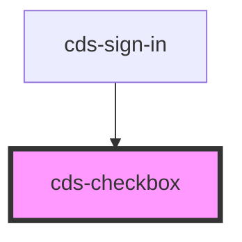

# cds-checkbox

<!-- Auto Generated Below -->

## Properties

| Property       | Attribute       | Description   | Type      | Default     |
| -------------- | --------------- | ------------- | --------- | ----------- |
| `checkboxId`   | `checkbox-id`   | Id            | `any`     | `undefined` |
| `checkboxName` | `checkbox-name` | Name          | `any`     | `undefined` |
| `checked`      | `checked`       | Checked       | `boolean` | `false`     |
| `class`        | `class`         | CSS Classes   | `string`  | `''`        |
| `disabled`     | `disabled`      | Disabled      | `boolean` | `false`     |
| `labelClass`   | `label-class`   | Label classes | `string`  | `''`        |

## Events

| Event              | Description                                      | Type               |
| ------------------ | ------------------------------------------------ | ------------------ |
| `cdsInputChange`   | cdsInputChange event, contains change from input | `CustomEvent<any>` |
| `cdsInputFocusIn`  | cdsInputFocusIn event - focusin event from input | `CustomEvent<any>` |
| `cdsInputFocusOut` | cdsInputFocusOut event - focusout event in Input | `CustomEvent<any>` |

## Slots

| Slot | Description |
| ---- | ----------- |
|      | Content     |

## Dependencies

### Used by

 - [cds-sign-in](../../patterns/sign-in)

### Graph

----------------------------------------------

*Built with [StencilJS](https://stenciljs.com/)*
