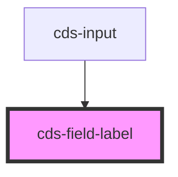

# cds-field-label

<!-- Auto Generated Below -->

## Properties

| Property   | Attribute   | Description | Type                                                     | Default     |
| ---------- | ----------- | ----------- | -------------------------------------------------------- | ----------- |
| `label`    | `label`     | Label       | `string`                                                 | `undefined` |
| `labelFor` | `label-for` | Field id    | `string`                                                 | `undefined` |
| `size`     | `size`      | Size        | `"is-large" \| "is-medium" \| "is-normal" \| "is-small"` | `undefined` |

## Dependencies

### Used by

 - [cds-input](../input)

### Graph

----------------------------------------------

*Built with [StencilJS](https://stenciljs.com/)*
