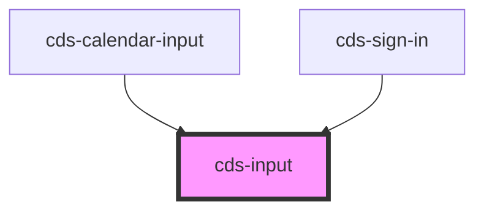

# cds-input

<!-- Auto Generated Below -->

## Properties

| Property          | Attribute          | Description                                                                                        | Type                                                    | Default     |
| ----------------- | ------------------ | -------------------------------------------------------------------------------------------------- | ------------------------------------------------------- | ----------- |
| `class`           | `class`            | CSS Classes                                                                                        | `string`                                                | `''`        |
| `controlClass`    | `control-class`    | Control Classes eg. has-icons                                                                      | `string`                                                | `''`        |
| `disabled`        | `disabled`         | Disabled state                                                                                     | `boolean`                                               | `false`     |
| `inputAttributes` | `input-attributes` | inputAttributes - adds custom attributes to the input field declared attributes will be overridden | `any`                                                   | `null`      |
| `inputId`         | `input-id`         | Unique id (used in input and label)                                                                | `string`                                                | `undefined` |
| `inputStatus`     | `input-status`     | Input status                                                                                       | `"danger" \| "success"`                                 | `undefined` |
| `label`           | `label`            | Label for input                                                                                    | `string`                                                | `undefined` |
| `loading`         | `loading`          | Loading state                                                                                      | `boolean`                                               | `false`     |
| `message`         | `message`          | Message                                                                                            | `string`                                                | `undefined` |
| `name`            | `name`             | Name                                                                                               | `string`                                                | `''`        |
| `placeholder`     | `placeholder`      | Placeholder                                                                                        | `string`                                                | `undefined` |
| `readonly`        | `readonly`         | The input will look similar to a normal one, but is not editable and has no shadow                 | `boolean`                                               | `false`     |
| `required`        | `required`         | Required                                                                                           | `boolean`                                               | `false`     |
| `rounded`         | `rounded`          | Rounded                                                                                            | `boolean`                                               | `false`     |
| `size`            | `size`             | Size                                                                                               | `"large" \| "medium" \| "normal" \| "small"`            | `undefined` |
| `state`           | `state`            | State                                                                                              | `"focused" \| "hovered"`                                | `undefined` |
| `static`          | `static`           | Removes the background, border, shadow, and horizontal padding                                     | `boolean`                                               | `false`     |
| `type`            | `type`             | Type                                                                                               | `"date" \| "email" \| "number" \| "password" \| "text"` | `'text'`    |
| `value`           | `value`            | Value                                                                                              | `number \| string`                                      | `undefined` |

## Events

| Event              | Description                                      | Type               |
| ------------------ | ------------------------------------------------ | ------------------ |
| `cdsInput`         | cdsInput event - InputEvent from input           | `CustomEvent<any>` |
| `cdsInputChange`   | cdsInputChange event - ChangeEvent from input    | `CustomEvent<any>` |
| `cdsInputFocusIn`  | cdsInputFocusIn event - focusin event from input | `CustomEvent<any>` |
| `cdsInputFocusOut` | cdsInputFocusOut event - focusout event in Input | `CustomEvent<any>` |

## Dependencies

### Used by

 - [cds-calendar-input](../../components/calendar/calendar-input)
 - [cds-sign-in](../../patterns/sign-in)

### Graph

----------------------------------------------

*Built with [StencilJS](https://stenciljs.com/)*
