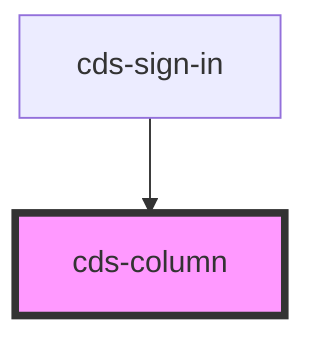

# cds-column

<!-- Auto Generated Below -->

## Properties

| Property | Attribute | Description   | Type                                                                                                                                                                                                                                            | Default     |
| -------- | --------- | ------------- | ----------------------------------------------------------------------------------------------------------------------------------------------------------------------------------------------------------------------------------------------- | ----------- |
| `class`  | `class`   | CSS Classes   | `string`                                                                                                                                                                                                                                        | `''`        |
| `narrow` | `narrow`  | Narrow column | `boolean`                                                                                                                                                                                                                                       | `undefined` |
| `size`   | `size`    | Sizes         | `"1" \| "2" \| "3" \| "4" \| "5" \| "6" \| "7" \| "three-quarters" \| "two-thirds" \| "half" \| "one-third" \| "one-quarter" \| "full" \| "four-fifths" \| "three-fifths" \| "two-fifths" \| "one-fifth" \| "8" \| "9" \| "10" \| "11" \| "12"` | `undefined` |

## Slots

| Slot | Description |
| ---- | ----------- |
|      | Content     |

## Dependencies

### Used by

 - [cds-sign-in](../../patterns/sign-in)

### Graph

----------------------------------------------

*Built with [StencilJS](https://stenciljs.com/)*
