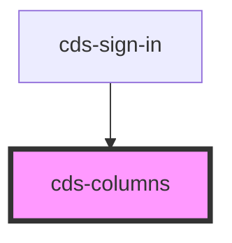

# cds-columns

<!-- Auto Generated Below -->

## Properties

| Property    | Attribute   | Description         | Type                                                          | Default     |
| ----------- | ----------- | ------------------- | ------------------------------------------------------------- | ----------- |
| `centered`  | `centered`  | Centered            | `boolean`                                                     | `false`     |
| `class`     | `class`     | CSS Classes         | `string`                                                      | `''`        |
| `desktop`   | `desktop`   | Desktop             | `boolean`                                                     | `false`     |
| `gapless`   | `gapless`   | Gapless             | `boolean`                                                     | `false`     |
| `gaps`      | `gaps`      | Columns gaps        | `"0" \| "1" \| "2" \| "3" \| "4" \| "5" \| "6" \| "7" \| "8"` | `undefined` |
| `mobile`    | `mobile`    | Mobile              | `boolean`                                                     | `false`     |
| `multiline` | `multiline` | Multiline           | `boolean`                                                     | `false`     |
| `vcentered` | `vcentered` | Vertically centered | `boolean`                                                     | `false`     |

## Slots

| Slot | Description |
| ---- | ----------- |
|      | Content     |

## Dependencies

### Used by

 - [cds-sign-in](../../patterns/sign-in)

### Graph

----------------------------------------------

*Built with [StencilJS](https://stenciljs.com/)*
