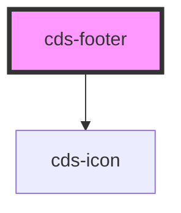

# cds-footer

<!-- Auto Generated Below -->

## Properties

| Property             | Attribute              | Description                           | Type                                                                         | Default          |
| -------------------- | ---------------------- | ------------------------------------- | ---------------------------------------------------------------------------- | ---------------- |
| `class`              | `class`                | CSS Classes                           | `string`                                                                     | `''`             |
| `color`              | `color`                | Color                                 | `"dark" \| "white"`                                                          | `'white'`        |
| `disclaimer`         | `disclaimer`           | Disclaimer                            | `string`                                                                     | `undefined`      |
| `disclaimerPosition` | `disclaimer-position`  | Social Links Position                 | `"center" \| "left" \| "right"`                                              | `'left'`         |
| `layout`             | `layout`               | layout                                | `"content-left" \| "content-right" \| "simple-center" \| "social-link-only"` | `'content-left'` |
| `links`              | `links`                | Links                                 | `string`                                                                     | `undefined`      |
| `socialBelowContent` | `social-below-content` | Social Links below footer content box | `boolean`                                                                    | `false`          |
| `socialLinks`        | `social-links`         | Social Links                          | `string`                                                                     | `undefined`      |

## Slots

| Slot | Description |
| ---- | ----------- |
|      | Content     |

## Dependencies

### Depends on

- [cds-icon](../../elements/icon)

### Graph

----------------------------------------------

*Built with [StencilJS](https://stenciljs.com/)*
