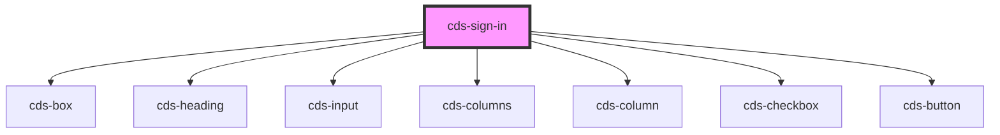

# cds-sign-in

<!-- Auto Generated Below -->

## Properties

| Property              | Attribute               | Description           | Type                                                         | Default              |
| --------------------- | ----------------------- | --------------------- | ------------------------------------------------------------ | -------------------- |
| `buttonLabel`         | `button-label`          | button label          | `string`                                                     | `'Sign in'`          |
| `class`               | `class`                 | CSS classes           | `string`                                                     | `undefined`          |
| `controlSize`         | `control-size`          | control size          | `"large" \| "medium" \| "normal" \| "small"`                 | `'normal'`           |
| `currentData`         | --                      | current Data          | `{ username: string; password: string; remember: boolean; }` | `undefined`          |
| `forgotPasswordLabel` | `forgot-password-label` | forgot password label | `string`                                                     | `'Forgot password?'` |
| `heading`             | `heading`               | heading               | `string`                                                     | `'Sign In'`          |
| `passwordLabel`       | `password-label`        | password label        | `string`                                                     | `'Password'`         |
| `passwordPlaceholder` | `password-placeholder`  | password placeholder  | `string`                                                     | `'Password'`         |
| `rememberLabel`       | `remember-label`        | remember label        | `string`                                                     | `'Remember me'`      |
| `size`                | `size`                  | size                  | `"large" \| "medium" \| "normal" \| "small"`                 | `'normal'`           |
| `usernameLabel`       | `username-label`        | username label        | `string`                                                     | `'Username'`         |
| `usernamePlaceholder` | `username-placeholder`  | username placeholder  | `string`                                                     | `'Username'`         |
| `usernameType`        | `username-type`         | username type         | `"email" \| "number" \| "text"`                              | `'text'`             |

## Events

| Event                   | Description                | Type               |
| ----------------------- | -------------------------- | ------------------ |
| `forgotPasswordClicked` | on forgot password clicked | `CustomEvent<any>` |
| `formSubmit`            | on form submit             | `CustomEvent<any>` |

## Slots

| Slot | Description |
| ---- | ----------- |
|      | Content     |

## Dependencies

### Depends on

- [cds-box](../../elements/box)
- [cds-heading](../../elements/heading)
- [cds-input](../../forms/input)
- [cds-columns](../../grid/columns)
- [cds-column](../../grid/column)
- [cds-checkbox](../../forms/checkbox)
- [cds-button](../../elements/button)

### Graph

----------------------------------------------

*Built with [StencilJS](https://stenciljs.com/)*
